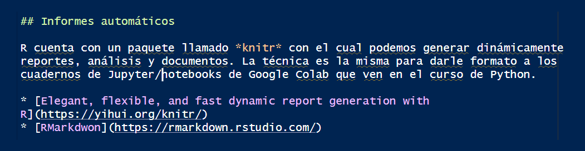
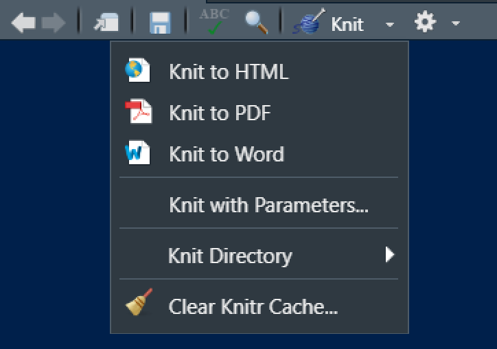
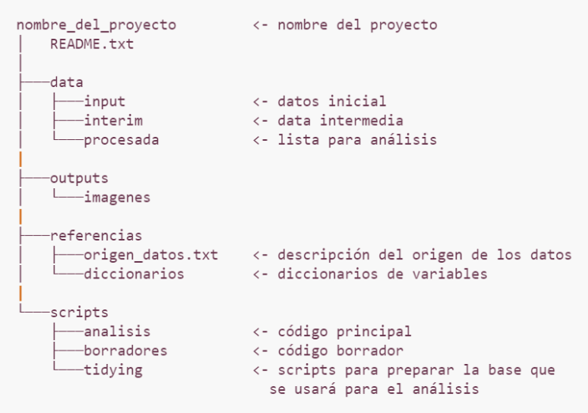

# Introducción

## ¿Qué es R?

* R es un lenguaje de programación de acceso libre, inicialmente diseñado y utilizado para realizar análisis estadístico.
* R también es un programa que instalamos para interpretar el código que escribimos.
* No fue creado por ingenieros de software para el desarrollo de software, sino por estadísticos como un ambiente interactivo para el análisis de datos.
* Además de R trabajaremos con RStudio, un IDE (Integrated Development Environment) que funciona como una "máscara" sobre R, con más herramientas y facilidades.
* La forma en que trabajaremos en R será a través de secuencias de comandos, conocidos como *script*, que se pueden ejecutar en cualquier momento. Estos *scripts* sirven como un registro del análisis realizamos.

## ¿Por qué nos gusta?

* Se ejecuta en todos los sistemas operativos principales: Windows, Mac Os, UNIX/Linux.
* Los *scripts* y los objetos de datos se pueden compartir sin problemas entre plataformas.
* No solamente permite realizar análisis estadístico, tambien es posible capturar información de páginas web, crear aplicaciones web, procesar texto, entre otras cosas.
* La comunidad que lo usa es muy amplia (= muchísima ayuda e información en internet).
  + [Stackoverflow](https://stackoverflow.com/questions/tagged/r)
  + [R-Universe](https://r-universe.dev/search/)
  + [R-Bloggers](https://www.r-bloggers.com/2015/12/how-to-learn-r-2/)
  + [Towards Data Science](https://towardsdatascience.com/tagged/r)
  + Entre otros.
* Es muy versátil para la creación de gráficos.
* Tiene disponibles muchos paquetes para diferentes tipos de análisis.
* ¡ES GRATIS!.

## Particularmente útil para

1. Manejar, combinar, limpiar y reorganizar datos.
2. Análisis estadístico, álgebra matricial, modelado, estadística avanzada.
3. Usar un entorno gráfico poderoso para explorar datos o para publicar.
4. Trabajar de forma reproducible a partir de *scripts*.

## Advertencias

* La documentación a veces es muy técnica o muy compacta.
* No todo el código ha sido exhaustivamente testeado, es decir, no siempre hay garantías que las cosas funcionen.
* La curva de aprendizaje es más difícil que programas como SPSS o Minitab (frente a Python, Stata o SAS es similar).

# Paquetes 

Cuando varias funciones son desarrolladas con un objetivos similar se suelen agrupar en *paquetes*, los cuales son colaborativamente distribuidos de forma gratuita.

Para utilizar las funciones de un paquete es necesario instalar este paquete primero usando **install.packages()** y luego cargarlo en nuestro ambiente de trabajo usando **library()**.

* Se instalan una vez y se llaman muchas veces.
* [Lista de paquetes del CRAN](https://cran.r-project.org/web/packages/available_packages_by_date.html)
* [Lista de paquetes de Bioconductor](https://www.bioconductor.org/packages/release/bioc/)
* [rdrr.io](https://rdrr.io/)

## El ecosistema tidyverse

**Tidyverse** es un conjunto de paquetes de R diseñados para hacer el análisis de datos más intuitivo y consistente. Estos paquetes comparten principios y sintaxis comunes, lo que permite trabajar de manera eficiente con datos estructurados. El núcleo de `tidyverse` incluye paquetes populares como:

- **ggplot2**: Para visualización de datos.
- **dplyr**: Para manipulación y transformación de datos.
- **tidyr**: Para ordenar y reorganizar datos.
- **readr**: Para leer datos en diferentes formatos.
- **tibble**: Para trabajar con tablas de datos mejoradas.
- **stringr**: Para manipulación de cadenas de caracteres.
- **purrr**: Para trabajar con programación funcional.

El enfoque principal de `tidyverse` es organizar los datos en un formato "ordenado" (tidy), donde cada variable es una columna, cada observación es una fila, y cada tipo de unidad observacional forma una tabla. Esto facilita tanto la manipulación como el análisis, haciendo que el flujo de trabajo sea más eficiente y claro.


## Visualización usando ggplot

**ggplot2** es  un **paquete específico** dentro del ecosistema `tidyverse` para la visualización de datos en R. Está basado en la gramática de gráficos (grammer of graphics), lo que permite crear gráficos complejos a partir de componentes simples.

Con `ggplot2`, es posible construir gráficos declarando los diferentes elementos que lo componen (ejes, datos, geometrías, capas, colores, etc.) y combinándolos de manera flexible. A diferencia de otros enfoques, en lugar de especificar un tipo de gráfico desde el principio, en `ggplot2` construyes los gráficos de manera incremental a través de capas.


Las **extensiones de ggplot2** son paquetes adicionales que amplían la funcionalidad de `ggplot2`, permitiendo crear gráficos más complejos o personalizar las visualizaciones de manera más específica. Estas extensiones se construyen sobre la estructura básica de `ggplot2` y ofrecen nuevas geometrías, temas, escalas, y otras características.

Algunas de las extensiones más populares son:

 - **ggthemes**: Proporciona una amplia variedad de temas predefinidos para personalizar el estilo de los gráficos, como temas inspirados en periódicos o plataformas como Excel o Stata.

 - **ggplotly**: Convierte gráficos de `ggplot2` en gráficos interactivos utilizando la librería `plotly`. Ideal para visualizaciones dinámicas.

 - **gghighlight**: Permite resaltar ciertas observaciones en un gráfico basado en una condición, sin necesidad de manipular manualmente los datos.

 - **gganimate**: Añade una dimensión temporal a los gráficos, creando animaciones para mostrar cómo los datos cambian con el tiempo.

## Shiny

**Shiny** es un paquete de R que permite construir aplicaciones web interactivas de manera sencilla, sin necesidad de tener conocimientos avanzados de desarrollo web. Fue creado por **RStudio** y se utiliza principalmente para compartir análisis de datos y visualizaciones interactivas con otros usuarios a través de un navegador web.

Shiny combina el poder de R para análisis estadístico y visualización con herramientas de diseño web (HTML, CSS, y JavaScript), lo que permite crear aplicaciones dinámicas que responden a entradas del usuario, actualizando gráficos, tablas y modelos en tiempo real. Sus características principales son:

- **Interactividad**: Los usuarios pueden modificar la entrada (input) y ver cambios instantáneos en la salida (output), como gráficos, tablas, o resultados estadísticos.
  
- **Flexibilidad**: Permite integrar elementos HTML, CSS y JavaScript para mejorar la apariencia y funcionalidad de las aplicaciones.

- **Servidor y UI**: Las aplicaciones en Shiny se estructuran en dos partes principales:

  - **UI (User Interface)**: Define el diseño de la interfaz que el usuario ve, como botones, campos de entrada, menús desplegables, etc.

  - **Server**: Contiene la lógica y el procesamiento que ocurre cuando el usuario interactúa con la interfaz.

Shiny es ampliamente utilizado en ciencia de datos para crear dashboards, herramientas de visualización y aplicaciones de análisis interactivo, y permite compartir análisis de manera efectiva con personas que no necesariamente conocen R.

## Reportería

Los paquetes **`knitr`**, **`rmarkdown`** y **`quarto`** son herramientas complementarias en el ecosistema R para la creación de documentos reproducibles y la generación de informes. Cada uno de estos paquetes tiene una función específica, pero a menudo se utilizan juntos para producir documentos de alta calidad.

### knitr

**`knitr`** se utiliza para integrar código R dentro de documentos de texto, permitiendo la generación de informes dinámicos. Se encarga de ejecutar el código R y mostrar los resultados (tablas, gráficos, etc.) directamente en el documento. `knitr` convierte los bloques de código R en resultados formateados y los inserta en el documento de salida, facilitando la creación de informes reproducibles.

- **Características**:
  - Ejecución de código R y generación de resultados.
  - Inserción de resultados en documentos de texto.
  - Soporte para diversos formatos de salida a través de paquetes complementarios (como `rmarkdown`).


### rmarkdown

**`rmarkdown`** amplía la funcionalidad de `knitr` permitiendo la creación de documentos dinámicos y de presentación en varios formatos, como HTML, PDF y Word. Utiliza Markdown para estructurar el contenido del documento, lo que facilita la combinación de texto, código y resultados en un formato de salida estéticamente agradable.

- **Características**:
  - Soporte para múltiples formatos de salida: HTML, PDF, Word.
  - Uso de Markdown para la estructuración del texto.
  - Integración con `knitr` para ejecutar y mostrar código R.
  - Opciones avanzadas para personalizar la apariencia y el contenido del documento.


### quarto

**`quarto`** es una herramienta más reciente que ofrece una alternativa moderna y flexible a `rmarkdown`. Está diseñada para crear documentos reproducibles, informes y presentaciones, y se basa en un formato de archivo y un flujo de trabajo similar a `rmarkdown`, pero con mejoras en la funcionalidad y la integración con otros sistemas.

- **Características**:
  - Soporte para la creación de documentos, presentaciones, libros y sitios web.
  - Mejora en la compatibilidad con varios lenguajes de programación además de R, como Python.
  - Facilita la integración de contenido y la creación de documentos reproducibles en un formato más moderno.
  - Permite la creación de informes interactivos y contenido dinámico.


Estos paquetes se utilizan en conjunto para crear documentos reproducibles que combinan texto, código y resultados en un formato de salida atractivo y profesional. Mientras que `knitr` y `rmarkdown` han sido herramientas establecidas durante años, `quarto` representa una evolución en la creación de documentos dinámicos y reproducibles, con un enfoque más amplio y flexible.

* [Elegant, flexible, and fast dynamic report generation with R](https://yihui.org/knitr/)
* [RMarkdwon](https://rmarkdown.rstudio.com/)

{width=70%}

{width=70%}


# RStudio

**RStudio** es un entorno de desarrollo integrado (IDE) para el lenguaje de programación R, diseñado para facilitar la escritura de código, la visualización de datos y la creación de informes reproducibles. Ofrece una serie de herramientas y características que mejoran la productividad y la eficiencia en el trabajo con R. RStudio es desarrollado por **Posit**.

**Posit** es una empresa social que desarrolla herramientas de código abierto para el análisis de datos y la ciencia de datos. Desde su cambio de nombre de RStudio a Posit en 2023, la empresa ha seguido comprometida con la misión de mejorar la accesibilidad y el impacto del análisis de datos a través de software libre y colaborativo.


## Proyectos de RStudio

En RStudio, los **proyectos** son una característica que ayuda a organizar y gestionar el trabajo de forma estructurada y eficiente. Un proyecto en RStudio es un contenedor para archivos y configuraciones que se usan en un análisis o en una investigación específica. Aquí están algunas de las principales características y ventajas de utilizar proyectos en RStudio:

Características de los proyectos en RStudio:

 - **Aislamiento del Entorno**: Cada proyecto tiene su propio entorno de trabajo, con sus propios archivos, paquetes y configuraciones. Esto evita conflictos entre diferentes proyectos y facilita el manejo de múltiples análisis simultáneamente.

 - **Directorio de Trabajo**: Cuando se abre un proyecto, RStudio establece automáticamente el directorio de trabajo en la carpeta del proyecto. Esto significa que todos los archivos y datos se referencian con rutas relativas al proyecto, simplificando la gestión de archivos.

 - **Configuración del Proyecto**: Los proyectos guardan configuraciones específicas, como opciones de R y ajustes de paquetes. Esto incluye la posibilidad de establecer opciones como la versión de R, el directorio de datos, y configuraciones personalizadas.

 - **Historial y Scripts**: RStudio mantiene el historial de comandos y los scripts utilizados en cada proyecto, lo que permite una fácil recuperación y seguimiento del trabajo realizado.

 - **Archivos de Proyecto**: Los proyectos suelen incluir un archivo `.Rproj`, que almacena la configuración del proyecto y ayuda a RStudio a identificar y abrir el proyecto correctamente. También puedes incluir otros archivos como scripts, datos, documentos, entre otros.

 - **Integración con Control de Versiones**: Los proyectos pueden integrarse con sistemas de control de versiones como Git, facilitando la gestión de versiones y la colaboración en proyectos de análisis de datos.

## Buenas prácticas

Al trabajar con R y en la programación en general, es importante seguir ciertas buenas prácticas para mantener el código limpio, eficiente y fácil de mantener. Aquí algunas recomendaciones clave:

### Usar scripts

- **Uso de scripts**: Aunque es común ejecutar código directamente en la consola durante las primeras interacciones con R, es una buena práctica guardar el código en **scripts**. Los scripts permiten documentar y reutilizar el código de manera más organizada.
  - **Archivos `.r`**: Son los scripts de R tradicionales.
  - **Archivos `.rmd`**: Archivos de R Markdown que combinan texto y código en un solo documento, permitiendo generar informes dinámicos.
  - **Archivos `.qmd`**: Archivos de Quarto que también combinan texto y código, pero con una estructura más moderna y flexible.

### Manejo de mensajes de advertencia y errores

- **Copiar y buscar**: Si encuentras mensajes de advertencia (`warning`) o errores (`error`), copia el mensaje y realiza una búsqueda en Google, ChatGPT, o Gemini para encontrar soluciones. Estos recursos pueden ofrecer soluciones a problemas comunes y explicaciones detalladas.

### Comentar el código

- **Uso de comentarios**: Añadir comentarios al código es fundamental para la comprensión y mantenimiento. Los comentarios se insertan anteponiendo el símbolo `#` en la línea deseada.
  - **Herramientas de asistencia**: Utiliza herramientas como GitHub Copilot para obtener sugerencias de comentarios y documentación. 
  - **Atajo de teclado**: En RStudio, puedes usar el atajo `Ctrl` + `Shift` + `R` (Windows/Linux) o `Cmd` + `Shift` + `R` (Mac) para comentar o descomentar líneas de código de forma rápida.

### Consultar la ayuda en R

- **Uso de funciones de ayuda**: R ofrece varias maneras de acceder a la documentación y ayuda sobre funciones y paquetes:

```{r}
# Consulta la ayuda de la función específica
?function_name
  
# Consulta ayuda sobre un término o función con una búsqueda más amplia
??search_term
```

Por ejemplo:

```{r}
?mean          # Muestra la documentación para la función mean

??mean          # Realiza una búsqueda sobre el término "mean" en la documentación

```

Estas prácticas nos ayudan a mantener un flujo de trabajo eficiente y organizado, facilitando tanto el desarrollo como el mantenimiento de proyectos en R.

## Creación de nuestro primer proyecto

1. Abrir RStudio.
2. Clic en **File > New Project**
    + **New Directory > New Project** si queremos crear una nueva carpeta en nuestro equipo.
    + **Existing Directory** si queremos alojar nuestro proyecto en una carpeta ya creada.
3. Una vez creado el proyecto, podemos verificar que la ventana del programa se renombra y apunta a la carpeta donde está alojado.
4. Clic en **File > New File > R Script**. En la ventana que se carga ya podemos empezar a ejecutar nuestro código.
5. Descargamos [la carpeta](02_recursos/informe.zip) con algunos recursos para informes automáticos y los llevamos a nuestra carpeta de proyecto.
6. Configuramos RStudio para que use la carpeta de proyecto como directorio principal.
7. Iniciamos la programación.

{width=70%}

