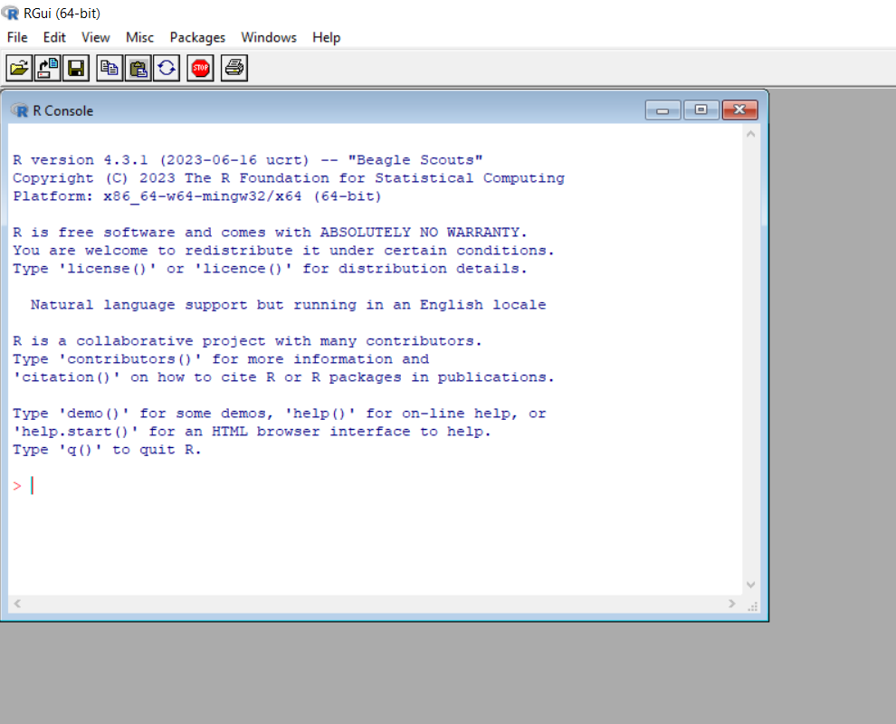
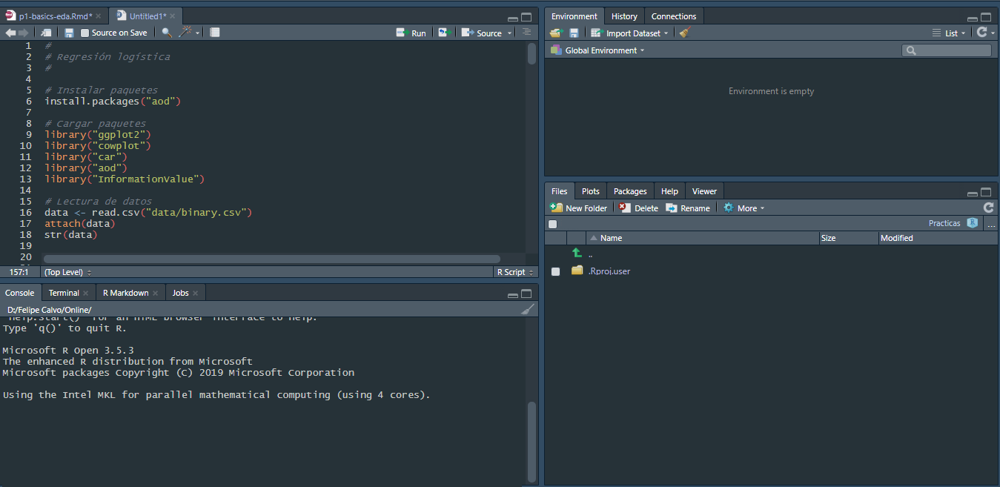

# Introducción


## Instalación de R

[https://cran.r-project.org/](https://cran.r-project.org/) 

{width=70%}

> Luego de instalar R, se recomienda instalar [Rtools](https://cran.r-project.org/bin/windows/Rtools/).


## Interfaces de usuario

* Por defecto
* [RStudio](https://posit.co/downloads/) - Recomendada. Es la que usaremos en este curso.
* [Jupyter](https://jupyter.org/)
* [Eclipse](http://www.eclipse.org/eclipse)
* Entre otras

 

## Front-ends gráficos

* [Rcmdr](https://socialsciences.mcmaster.ca/jfox/Misc/Rcmdr/)
* [RKWard](https://rkward.kde.org/)

## ¿Cómo correr comandos/código?

* Si se está trabajando en el panel **console** solamente es necesario presionar “Enter”.
* Si se está trabajando en un **script** es posible ejecutar los comandos presionando "Ctrl+Enter", o haciendo clic en el botón *Run* en la parte derecha superior del panel de edición.


## Actualizar R (si ya lo tenías instalado) y los paquetes

```{r}
#| eval: false

# Instalar el paquete installr
install.packages("installr")
# Cargar el paquete
library(installr) 
# Comando para actualizar R
updateR()
# Comando para actualizar paquetes
update.packages(checkBuilt = TRUE, ask = FALSE)
```


