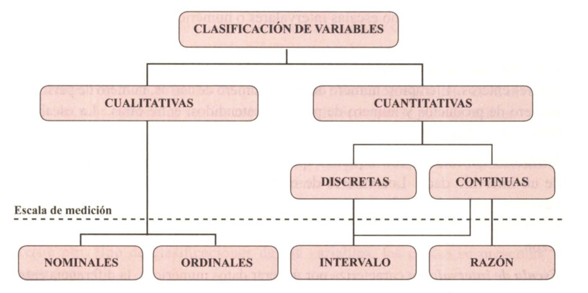
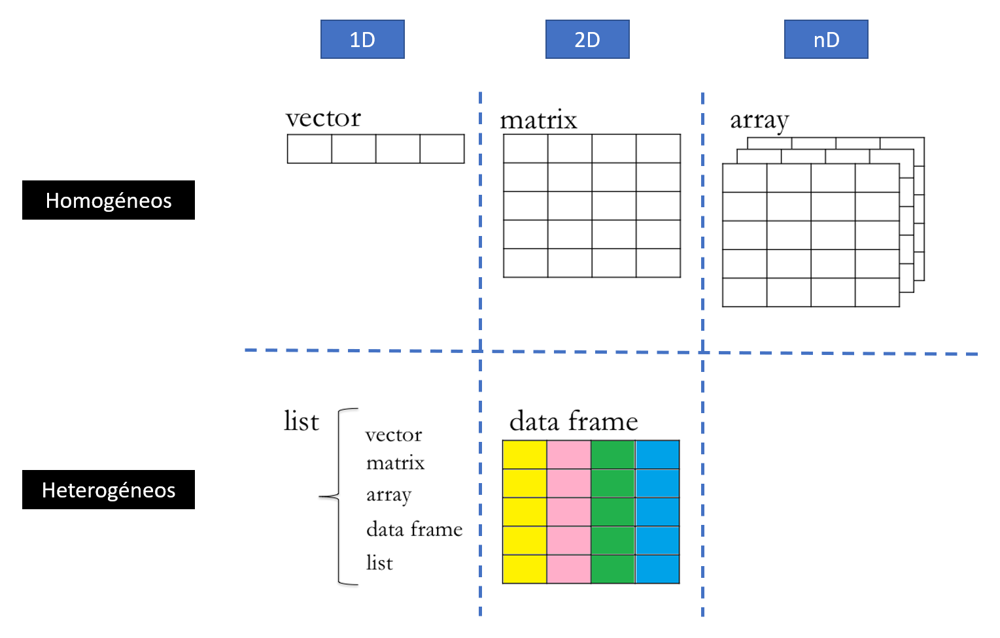
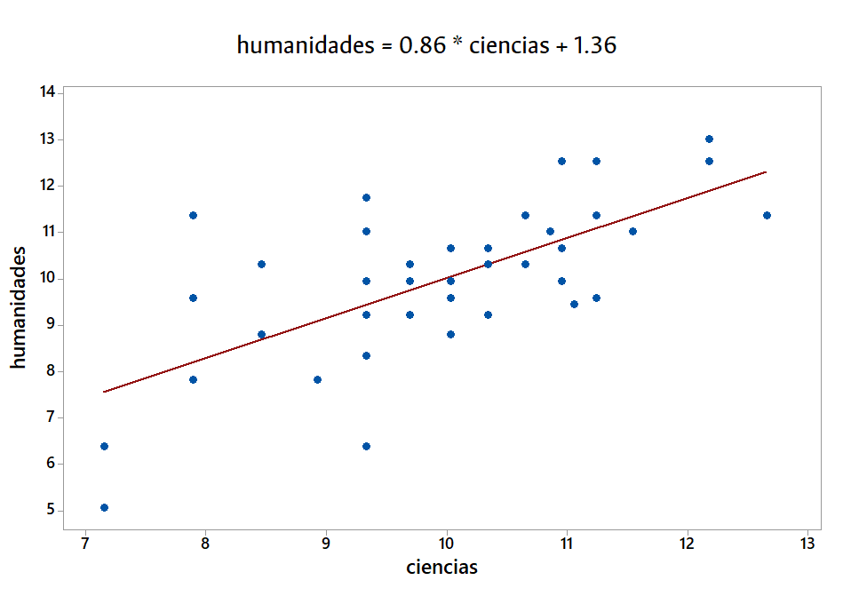
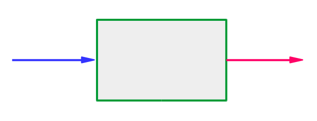
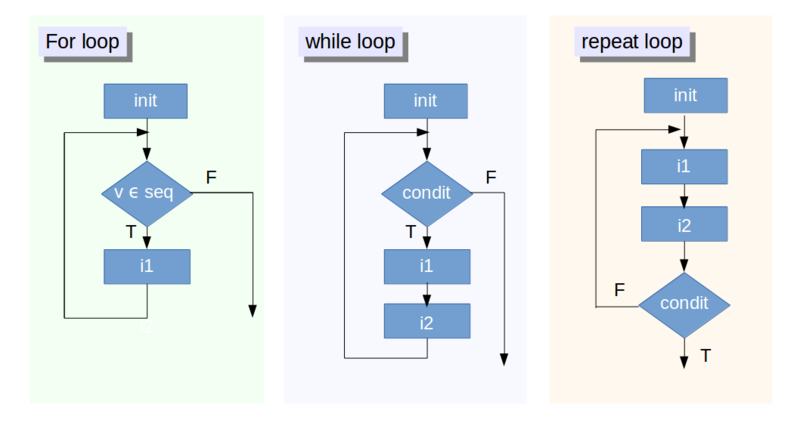
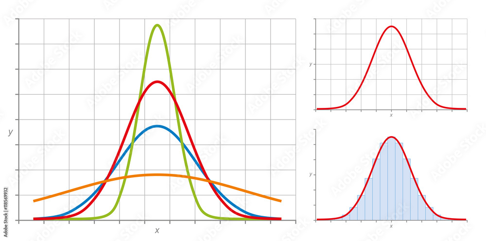

# Datos y variables


## Variables y datos

* **Variables**: característica observable o un aspecto discernible en un objeto de estudio, que puede adoptar diferentes valores o expresarse en varias categorías.
* **Dato**: realización, representación o valor observado de una variable.


### Asignación

En R, la **asignación** se refiere al proceso de almacenar un valor o conjunto de valores en una variable. Esto permite reutilizar esos valores más adelante en el código. La asignación en R se realiza mediante los operadores `<-`, `=` o `->`. El operador más común y recomendado en R es `<-` tiene un atajo en Windows/Linux `Alt` + `-` y en Mac `Option` + `-`


```{r}
# Una forma de hacer asignación
objeto <- "valor"
# Otra forma
objeto = "valor"
# Otro forma
"valor" -> objeto
# Ejemplos
pais = "Colombia"
departamentos = 32
trm = 4000.5
tenemos_mar = TRUE

```

## Tipos de variables y operaciones

### Enfoque teórico

Una apriximación muy completa se encuentra en [este material](https://dialnet.unirioja.es/descarga/articulo/4942056.pdf). En resumen

En estadística, las variables se pueden clasificar de distintas maneras dependiendo de su naturaleza y de los valores que pueden tomar. Aquí te detallo los tipos más comunes:

#### Según la naturaleza de los datos:

**Variables cualitativas (categóricas)**
Son aquellas que expresan cualidades o atributos y no se pueden medir numéricamente de manera directa. Se clasifican en:

 - **Nominales**: No tienen un orden natural, simplemente diferencian categorías. Ejemplos: color de ojos (azul, verde, marrón), estado civil (soltero, casado).
  
 - **Ordinales**: Tienen un orden o jerarquía, pero las diferencias entre categorías no son numéricas. Ejemplos: nivel educativo (primaria, secundaria, universidad), nivel de satisfacción (bajo, medio, alto).

**Variables cuantitativas (numéricas)**
Son aquellas que se pueden medir numéricamente y permiten realizar operaciones matemáticas. Se dividen en:

 - **Discretas**: Solo toman valores enteros y finitos. Son el resultado de un conteo. Ejemplos: número de hijos, número de autos en un estacionamiento.

 - **Continuas**: Pueden tomar cualquier valor dentro de un intervalo en la escala de medición. Generalmente son el resultado de una medición. Ejemplos: peso, altura, temperatura.

#### Según el nivel de medición:

En este caso tenemos cuatro categorías:

- **Escala nominal**: Clasifica los datos en categorías sin ningún orden. Ejemplo: género (masculino, femenino).
  
- **Escala ordinal**: Clasifica los datos en categorías que tienen un orden. Ejemplo: calificación de un servicio (bueno, regular, malo).
  
- **Escala de intervalo**: Las diferencias entre valores tienen sentido, pero no existe un cero absoluto. Ejemplo: temperatura en grados Celsius.
  
- **Escala de razón**: Tiene todas las propiedades de la escala de intervalo, pero con un cero absoluto, lo que permite interpretar razones. Ejemplo: peso, altura, tiempo.

{width=70%}

### Enfoque desde la programación

En R, existen varios tipos de datos fundamentales que sirven para almacenar y manipular información. A continuación, te enumero los principales:

#### Objetos atómicos

**Cadenas de caracteres (character)**: Son datos que almacenan texto. Se representan entre comillas dobles o simples. Ejemplo: `"Hola"` o `'Mundo'`.

**Numéricos**: Son datos numéricos y pueden ser tanto enteros como números con decimales. Ejemplos:
   - Entero: `5`
   - Decimal: `3.14`

**Enteros**: Un subconjunto de los datos numéricos que almacena solo números enteros. Para declarar explícitamente un entero, se utiliza la función `as.integer()` o se añade una "L" después del número. Ejemplo: `4L`.

**Lógicos (booleanos)**: Tienen solo dos valores posibles: `TRUE` o `FALSE`. Estos son útiles en operaciones de comparación o condicionales.

#### Objetos anidados

**Factores**: Se utilizan para variables categóricas, donde cada categoría tiene un valor asociado. Los factores se usan frecuentemente en análisis estadístico para variables cualitativas. Ejemplo: `factor(c("rojo", "azul", "verde"))`.

**Vectores**: Son secuencias de elementos del mismo tipo de datos (numéricos, lógicos, etc.). Ejemplo: `c(1, 2, 3)` o `c("a", "b", "c")`.

**Listas**: Pueden contener elementos de diferentes tipos de datos, como números, caracteres, o incluso otros vectores o listas. Ejemplo: `list(1, "a", TRUE)`.

**Matrices**: Son arreglos bidimensionales donde todos los elementos son del mismo tipo. Ejemplo: `matrix(1:6, nrow = 2, ncol = 3)`.

**Arreglos (arrays)**: Son como matrices, pero pueden tener más de dos dimensiones. Ejemplo: `array(1:12, dim = c(3, 2, 2))`.

**Data frames**: Son estructuras de datos tabulares que permiten almacenar columnas de diferentes tipos de datos (como una tabla en Excel). Ejemplo: `data.frame(nombre = c("Juan", "Ana"), edad = c(25, 30))`.

#### Objetos especiales

**NA (Not Available)**: Representa un valor perdido o no disponible. Se utiliza comúnmente en datasets incompletos.

## Tipos de objetos en R

### Cadenas de caracteres

En R, las **cadenas de caracteres** (*strings*) son secuencias de caracteres alfanuméricos que se almacenan en objetos. Estas cadenas se delimitan utilizando comillas dobles (`" "`) o simples (`' '`). Se utilizan para representar palabras, frases o cualquier tipo de texto. Por medio de la sintaxis, pueden ser manipuladas y procesadas; para ello se usan diversas funciones de R, como concatenación, búsqueda de patrones o modificación de contenido.

Algunas funciones para trabajar con cadenas de caracteres son:

- `toupper()` y `tolower()`: Convierte el texto a mayúsculas o minúsculas.
- `nchar()`: Devuelve la longitud de la cadena.
- `paste()`: Combina cadenas.
- `substr()`: Extrae partes de una cadena.

Las cadenas son un tipo de dato fundamental para trabajar con texto en análisis de datos y procesamiento de información textual.

Adicionalmente, el paquete `stringr` del ecosistema `tidyverse` implementa funciones específicas para manipular y procesar cadenas de caracteres de manera más eficiente y consistente. Algunas de las funciones más comunes de `stringr` incluyen:

- `str_length()`: Calcula la longitud de una cadena.
- `str_c()`: Concatenar varias cadenas.
- `str_sub()`: Extraer o reemplazar partes de una cadena según la posición.
- `str_detect()`: Detectar la presencia de un patrón en una cadena.
- `str_replace()` y `str_replace_all()`: Reemplazar partes de una cadena que coinciden con un patrón.
- `str_split()`: Dividir una cadena en partes basadas en un delimitador.
- `str_to_upper()` y `str_to_lower()`: Convertir cadenas a mayúsculas o minúsculas.

Ejemplo:

```{r}
objeto_nombrado_por_mi <- "hola mundo"
objeto_nombrado_por_mi
class(objeto_nombrado_por_mi)
is.character(objeto_nombrado_por_mi)
```


### Booleanos (lógicos)

En R, los **booleanos** o **lógicos** son un tipo de dato fundamental que representa valores de verdad. Los objetos lógicos en R se utilizan para realizar operaciones de comparación y para controlar el flujo de ejecución en el código.

- **Valores posibles**: Los valores lógicos en R son `TRUE` y `FALSE`.

- **Uso en comparaciones**: Se utilizan para evaluar condiciones en expresiones lógicas, como en las declaraciones `if` y `while`.

- **Operadores lógicos**:

  - **AND lógico**: `&` (elemento a elemento) y `&&` (solo el primer elemento de cada vector).

  - **OR lógico**: `|` (elemento a elemento) y `||` (solo el primer elemento de cada vector).

  - **NOT lógico**: `!` (negación de una expresión lógica).


**Creación de valores lógicos**:

```{r}
a <- TRUE
b <- FALSE
```

**Operaciones lógicas básicas**:
```{r}
# Comparaciones
5 > 3        # TRUE
5 < 3        # FALSE

# Operadores lógicos
x <- TRUE
y <- FALSE

x & y        # FALSE (AND lógico)
x | y        # TRUE (OR lógico)
!x           # FALSE (NOT lógico)
```

**Uso en estructuras de control**:

```{r}
# Estructura if
age <- 20
if (age >= 18) {
  print("Adulto")
} else {
  print("Menor de edad")
}
```

**Aplicaciones en funciones y subsetting**:

```{r}
# Subsetting de vectores usando valores lógicos
numbers <- c(1, 2, 3, 4, 5)
logical_vector <- numbers > 3
numbers[logical_vector]  # Devuelve 4 y 5
```

Los valores booleanos son esenciales para la toma de decisiones y el control de flujo en R, y son ampliamente utilizados en la programación para realizar operaciones condicionales y filtrado de datos.

```{r}
objeto_nombrado_por_mi <- TRUE # Siempre con mayúsculas
objeto_nombrado_por_mi
class(objeto_nombrado_por_mi)
is.logical(objeto_nombrado_por_mi)
```

Aquí está la explicación sobre los objetos numéricos en R y el código que has proporcionado:

### Numéricos

En R, los objetos numéricos se utilizan para representar valores cuantitativos. Estos pueden ser enteros, decimales o de precisión simple. Los números en R son generalmente tratados como vectores y pueden ser de diferentes clases como `numeric` o `integer`.

Ejemplos de código:

```{r}
pi
```

- **`pi`**: Este es un objeto predefinido en R que representa el número π (pi). Por defecto, `pi` es de tipo `numeric`.

```{r}
objeto_nombrado_por_mi <- 0
```

- **`objeto_nombrado_por_mi`**: Se crea un objeto numérico con el valor 0 y se asigna a la variable `objeto_nombrado_por_mi`. Por defecto, los números en R se consideran de tipo `numeric`, a menos que se especifique lo contrario.

```{r}
objeto_nombrado_por_mi
```

- **Mostrar el valor**: Imprime el valor del objeto `objeto_nombrado_por_mi`, que es 0.

```{r}
class(objeto_nombrado_por_mi)
```

- **`class()`**: Esta función muestra la clase del objeto `objeto_nombrado_por_mi`. Para un número simple, la clase será `numeric`.

```{r}
is.numeric(objeto_nombrado_por_mi)

```

- **`is.numeric()`**: Esta función verifica si el objeto `objeto_nombrado_por_mi` es de tipo `numeric`. En este caso, devolverá `TRUE` porque `objeto_nombrado_por_mi` es un número y, por defecto, los números en R son `numeric`.

1. **`pi`**: Imprime el valor de π (aproximadamente 3.141593).
2. **`objeto_nombrado_por_mi`**: Imprime `0`.
3. **`class(objeto_nombrado_por_mi)`**: Imprime `numeric`.
4. **`is.numeric(objeto_nombrado_por_mi)`**: Imprime `TRUE`.

- **Numéricos en R**: Los objetos numéricos son fundamentales para realizar cálculos y análisis cuantitativos. Los números en R se manejan principalmente como objetos `numeric`, que incluyen tanto enteros como números de punto flotante (decimales). Puedes verificar la clase y el tipo de un objeto numérico usando funciones como `class()` y `is.numeric()`.


Aquí tienes una explicación sobre cómo manejar fechas en R y el código proporcionado:

### Fechas

En R, las fechas pueden representarse y manipularse de manera efectiva utilizando objetos de la clase `Date`. Es importante seguir formatos estándar como ISO 8601 (YYYY-MM-DD) para asegurar la correcta interpretación de las fechas.

Ejemplo de código:

```{r}
objeto_nombrado_por_mi <- "1969-07-21" # Recomendado: ISO 8601 para fechas
objeto_nombrado_por_mi

```


- **`objeto_nombrado_por_mi`**: Aquí se asigna una fecha en formato de cadena de texto a la variable `objeto_nombrado_por_mi`. Aunque esto es un formato legible, R no lo trata automáticamente como una fecha.

```{r}
class(objeto_nombrado_por_mi)
```

- **`class()`**: Esta función muestra la clase del objeto `objeto_nombrado_por_mi`. En este caso, la clase será `character` porque la fecha está almacenada como una cadena de texto.

```{r}
otro_objeto_distinto <- as.Date(objeto_nombrado_por_mi)

```

- **`as.Date()`**: Convierte el objeto de texto `objeto_nombrado_por_mi` a un objeto de clase `Date`. Esta función interpreta la cadena en formato "YYYY-MM-DD" y la convierte a un objeto de fecha.

```{r}
class(otro_objeto_distinto)

```

- **`class()`**: Esta función muestra la clase del objeto `otro_objeto_distinto`. Después de la conversión con `as.Date()`, la clase será `Date`, que es el tipo adecuado para trabajar con fechas en R.

1. **`objeto_nombrado_por_mi`**: Imprime `"1969-07-21"`, que es una cadena de texto.
2. **`class(objeto_nombrado_por_mi)`**: Imprime `"character"`, indicando que el objeto es una cadena de texto.
3. **`otro_objeto_distinto`**: Después de la conversión, imprime la fecha en formato de objeto `Date`, que será `1969-07-21`.
4. **`class(otro_objeto_distinto)`**: Imprime `"Date"`, indicando que el objeto es una fecha.

- **Representación de fechas en R**: Las fechas en R deben ser representadas como objetos de clase `Date` para facilitar la manipulación y análisis. Las cadenas de texto que representan fechas deben ser convertidas a objetos `Date` utilizando la función `as.Date()`.
- **Formato ISO 8601**: Usar el formato de fecha "YYYY-MM-DD" es una buena práctica porque es ampliamente reconocido y evita ambigüedades en la interpretación de las fechas.

El paquete **`lubridate`** en R facilita el manejo y la manipulación de fechas y horas. Proporciona funciones intuitivas para trabajar con fechas y tiempos, que son más accesibles en comparación con las funciones base de R. A continuación, se detallan algunas de las funciones más comunes del paquete `lubridate` y un ejemplo de cómo usarlas.

 - **`ymd()`**: Convierte cadenas de texto en el formato "YYYY-MM-DD" a objetos de clase `Date`.
 - **`dmy()`**: Convierte cadenas de texto en el formato "DD-MM-YYYY" a objetos de clase `Date`.
 - **`mdy()`**: Convierte cadenas de texto en el formato "MM-DD-YYYY" a objetos de clase `Date`.
 - **`now()`**: Devuelve la fecha y hora actuales en formato `POSIXct`.

```{r}
# Cargar el paquete
library("lubridate")

# Convertir una fecha en formato de texto a objeto Date
fecha_texto <- "21-07-1969"
fecha <- dmy(fecha_texto)
print(fecha)
# Resultado: [1] "1969-07-21"

# Obtener la fecha y hora actuales
ahora <- now()
print(ahora)
# Resultado: [1] "2024-09-12 10:30:00 UTC" (ejemplo)

# Extraer componentes de fecha y hora
year(ahora)   # Año
month(ahora)  # Mes
day(ahora)    # Día
hour(ahora)   # Hora

```

Aquí tienes una explicación sobre los valores especiales en R, incluyendo `NA`, `NULL` y otros valores especiales:

### Valores especiales en R

R tiene varios valores especiales que se utilizan para representar datos ausentes, desconocidos o estructuras vacías. Estos incluyen `NA`, `NULL`, `NaN` y `Inf`.

**`NA` (Not Available)**

`NA` se utiliza para representar datos faltantes o valores desconocidos en un vector o data frame. Indica que un valor no está disponible o no es aplicable. Se usa en datos para señalar que una observación está ausente.

```{r}
objeto_nombrado_por_mi <- NA # Siempre en mayúsculas NA
objeto_nombrado_por_mi
# Resultado: [1] NA
class(objeto_nombrado_por_mi)
# Resultado: [1] "logical"
```

**`NULL`**

`NULL` representa la ausencia de un valor o un objeto. Es utilizado para indicar que una variable o un objeto no existe o no ha sido inicializado. Se usa para representar la ausencia de datos o el resultado de operaciones que no devuelven ningún valor.

```{r}
objeto_nombrado_por_mi <- NULL
objeto_nombrado_por_mi
# Resultado: NULL
class(objeto_nombrado_por_mi)
# Resultado: [1] "NULL"
```

**`NaN` (Not a Number)**

`NaN` representa un valor que no es un número y resulta de operaciones matemáticas no definidas, como dividir cero por cero. Se usa para representar valores que no son numéricos debido a operaciones inválidas.

```{r}
objeto_nombrado_por_mi <- NaN
objeto_nombrado_por_mi
# Resultado: [1] NaN
class(objeto_nombrado_por_mi)
# Resultado: [1] "numeric"
```

**`Inf` y `-Inf` (Infinity)**

`Inf` y `-Inf` representan infinito positivo y negativo, respectivamente. Se resultan de operaciones como dividir un número positivo por cero o un número negativo por cero. Se usa para representar resultados infinitos en cálculos matemáticos.

```{r}
positivo_infinito <- Inf
negativo_infinito <- -Inf

positivo_infinito
# Resultado: [1] Inf

negativo_infinito
# Resultado: [1] -Inf
```

Aquí tienes la explicación detallada sobre identificación y conversión de tipos en R, usando las funciones `is` y `as`:

### Identificación y conversión de tipos en R

En R, es fundamental poder identificar el tipo de datos de un objeto y convertir entre diferentes tipos cuando sea necesario. Las funciones `is` permiten verificar el tipo de un objeto, mientras que las funciones `as` se utilizan para convertir entre tipos.

**`is`:** Las funciones `is` permiten verificar la clase o tipo de un objeto.

```{r}
cualquier_cosa <- TRUE
is.logical(cualquier_cosa)
# Resultado: TRUE (porque `cualquier_cosa` es de tipo lógico)

is.numeric(cualquier_cosa)
# Resultado: FALSE (porque `cualquier_cosa` es de tipo lógico, no numérico)

is.character(cualquier_cosa)
# Resultado: FALSE (porque `cualquier_cosa` es de tipo lógico, no carácter)

```

- **`is.logical()`**: Verifica si el objeto es de tipo lógico (`logical`).
- **`is.numeric()`**: Verifica si el objeto es de tipo numérico (`numeric`).
- **`is.character()`**: Verifica si el objeto es de tipo carácter (`character`).

**`as`:** Las funciones `as` permiten convertir objetos entre diferentes tipos.

```{r}
TRUE -> true_logico
true_logico
# Resultado: [1] TRUE

class(true_logico)
# Resultado: [1] "logical"

as.character(true_logico) -> true_char
true_char
# Resultado: [1] "TRUE"

class(true_char)
# Resultado: [1] "character"
```

- **`as.character()`**: Convierte el objeto a tipo carácter (`character`).
- **`as.numeric()`**: Convierte el objeto a tipo numérico (`numeric`).
- **`as.logical()`**: Convierte el objeto a tipo lógico binario (`logic`).

### Conversiones


Aquí tenemos una tabla que describe las conversiones entre diferentes tipos de datos en R, junto con ejemplos para cada caso:


| Desde       | Hacia       | Ejemplo de Conversión                        |
|-------------|-------------|----------------------------------------------|
| **logical** | **numeric** | `as.numeric(TRUE)` -> `1` <br> `as.numeric(FALSE)` -> `0` |
| **logical** | **character**| `as.character(TRUE)` -> `"TRUE"` <br> `as.character(FALSE)` -> `"FALSE"` |
| **numeric** | **character**| `as.character(123)` -> `"123"` <br> `as.character(4.56)` -> `"4.56"` |
| **numeric** | **Date**    | `as.Date(18993, origin = "1970-01-01")` -> `"2024-09-12"` (días desde el 1 de enero de 1970) |
| **character** | **Date**    | `as.Date("2024-09-12")` -> `"2024-09-12"` (fecha en formato "YYYY-MM-DD") |

## Operaciones


Las operaciones en R son funciones especiales que se comportan de manera particular en el lenguaje. Se caracterizan por las siguientes características:

 - **Funciones Internas**:  Las operaciones matemáticas y lógicas en R están implementadas como funciones internas del lenguaje. Por ejemplo, `+`, `-`, `*`, y `/` son en realidad funciones que realizan operaciones sobre los operandos que se les pasan.

 - **Sobrecarga de Operadores**: R permite la sobrecarga de operadores, lo que significa que los operadores pueden ser redefinidos para trabajar con objetos de clases específicas. Esto es útil en programación orientada a objetos para definir cómo los operadores deben comportarse con los objetos de una clase personalizada.

 - **Evaluación Vectorial**: Las operaciones en R son vectorizadas, lo que significa que se pueden aplicar directamente a vectores y matrices sin necesidad de escribir bucles explícitos. Cada operación se realiza elemento a elemento en los vectores o matrices.

 - **Precedencia de Operadores**: R sigue un orden específico de precedencia para evaluar expresiones. Esto determina el orden en el que se realizan las operaciones matemáticas y lógicas dentro de una expresión.

 - **Funciones Incorporadas**: Además de los operadores básicos, R tiene una variedad de funciones incorporadas para realizar operaciones matemáticas avanzadas, estadísticas, y lógicas. Estas funciones permiten realizar cálculos complejos y análisis de datos de manera eficiente.

 - **Manejo de Valores Especiales**: Las operaciones en R manejan valores especiales como `NA`, `NaN`, `Inf`, y `-Inf` de manera específica. Por ejemplo, las operaciones que involucran `NA` suelen devolver `NA`, y las operaciones con `NaN` pueden resultar en `NaN`.

### Operadores matemáticos

R proporciona una serie de operadores matemáticos para realizar cálculos básicos y avanzados:

```{r}
2 + 2        # Suma
5 - 2        # Resta
3 * 4        # Multiplicación
5 / 4        # División
9 %% 2       # Módulo (residuo de la división)
3 ** 3       # Exponenciación (elevado a la potencia)
3 ^ 3        # Exponenciación (elevado a la potencia, también válido)
log(10)      # Logaritmo natural (base e)
sqrt(16)     # Raíz cuadrada
```

### Operadores para comparación

Estos operadores permiten comparar valores y devolver resultados lógicos (`TRUE` o `FALSE`):

```{r}
5 > 2        # Mayor que
5 < 2        # Menor que
10 == 10     # Igual a
10 == 9      # No igual a
10 != 9      # Diferente de
10 >= 10     # Mayor o igual que
10 <= 8      # Menor o igual que
```

### Operadores lógicos

Los operadores lógicos se utilizan para combinar o negar condiciones:

- **Conjunción (AND)**: `&&` para comparación de una sola pareja de valores lógicos. 
- **Disyunción (OR)**: `||` para comparación de una sola pareja de valores lógicos.
- **Negación (NOT)**: `!` para invertir el valor lógico.

```{r}
# Conjunción (ambas condiciones deben ser verdaderas)
TRUE && FALSE
# Resultado: FALSE

# Disyunción (al menos una condición debe ser verdadera)
TRUE || FALSE
# Resultado: TRUE

# Negación (invierte el valor lógico)
!TRUE
# Resultado: FALSE
```

### Orden de las operaciones

El orden en que se realizan las operaciones es importante para obtener el resultado correcto. El orden de precedencia es el siguiente:

1. **Paréntesis**: `()` - Primero se evalúan las expresiones dentro de los paréntesis.
2. **Exponentes**: `^` o `**` - Luego se evalúan las potencias.
3. **Multiplicaciones y divisiones**: `*`, `/` y `%/%` - A continuación, se realizan las multiplicaciones y divisiones.
4. **Adición y sustracción**: `+` y `-` - Finalmente, se realizan las sumas y restas.

```{r}
# Ejemplo de orden de operaciones
resultado <- (3 + 2) * 4 ^ 2 / sqrt(16)
print(resultado)
# Resultado: [1] 20 (las operaciones se evalúan en el orden de precedencia)
```

## Objetos (variables)

```{r}
pi = 3.1415
radio = 3
area = pi * radio**2
area
round(area, 2)

```

### Vectores, matrices, arreglos, listas y tablas

* Vectores: Arreglos lineales del mismo tipo. Tienen la misma clase.
* Matrices: Arreglos rectangulares del mismo tipo. Sábanas de la misma clase.
* Arreglos: Organizaciones cúbicas y de mayor dimensión.
* Listas: Arreglos lineales de distintos tipos.
* Tablas: La estructura data.frame permite tener tablas de datos, donde cada columna es de un tipo determinado, pero no todas iguales.

{width=80%}

### Un tipo especial de variables: factores

Son vectores numéricos enmascarados como caracteres. Se usan para crear grupos usando clasificaciones o codificaciones de las variables de interés. Estos factores pueden o no tener un orden.

Ejemplos: estrato socioeconómico, nivel de estudios, mes, sexo, localidad.

### Vectores

```{r}
1:5
letters
LETTERS
c(1, 3, 2, 15, 4, 0, 0, 0, 1)
seq(10, 100)
seq(10, 100, by = 5)
seq(10, 100, length.out = 8)

```

### Factores

```{r}
as.factor(letters)
estrato = c(2,3,4,1,3,6,5,2,3,4,1,2,3,4,6)
estrato
estrato.factor = factor(estrato)
estrato.factor
estrato.factor.ordenado = factor(estrato, levels=c(1,2,3,4,5,6))
estrato.factor.ordenado
```

### Funciones sobre vectores

```{r}
vector_logico <- c(TRUE,FALSE,FALSE,TRUE,FALSE)
vector_cualquiera <- seq(1, 100, by = 3)
un_vector <- c(1, 2, 3, 4, 5)
otro_vector <- c(6, 7, 8, 9, 10)
```


```{r}
which(vector_logico) # me dice cuales son los verdaderos 
length(vector_cualquiera) # me dice cuánto mide el vector
c(un_vector, otro_vector) # concatena los vectores
```


### Operaciones entre vectores

```{r}
vector_numerico <- c(2, 4, 6, 8, 10)
vector_numeric_1 <- 1:3
vector_numeric_2 <- 3:5
```

```{r}
vector_numerico > 3
1:5 %in% 3:8
outer(vector_numeric_1, vector_numeric_2, "*")
outer(vector_numeric_1, vector_numeric_2, ">")
```


### Operaciones entre vectores (conjuntos)

```{r}
union(vector_numeric_1, vector_numeric_2)
intersect(vector_numeric_1, vector_numeric_2)
setdiff(vector_numeric_1, vector_numeric_2)
```

### Matrices

```{r}
matrix(data = 1:12, nrow = 3)
matrix(data = 1:12, nrow = 6)
matrix(data = 1:12, ncol = 6)
matrix(data = 1:12, nrow = 4)
matrix(data = 1:12, nrow = 4, byrow = TRUE)
matrix(data = seq(0, 9, length.out = 4), nrow = 2) -> mi_matriz
mi_matriz
```

### Operaciones sobre matrices

```{r}
#| eval: false
otra_matriz # Toca inventársela
mi_matriz*2 # Producto por un escalar
mi_matriz + otra_matriz # Suma de matrices
mi_matriz*otra_matriz # Producto celda por celda
mi_matriz %*% otra_matriz # Producto de matrices
```

### Funciones sobre matrices

```{r}
t(mi_matriz) #mi_matriz transpuesta
diag(mi_matriz) #Diagonal de mi_matriz
det(mi_matriz) # Determinante, debe dar un número
solve(mi_matriz) # Matriz inversa, sólo se puede con matrices cuadradas de determinante distinto de cero
dim(mi_matriz) # Dimensión de mi matriz
```

> Bibliografía complementaria: [Parte 1 Capítulo 2: Linear Algebra, del libro Deep Learning del MIT](https://www.deeplearningbook.org/)

### Tablas

* [Tidy tables](https://www.jstatsoft.org/article/view/v059i10/v59i10.pdf)


```{r}
#| message: false
#| echo: false

library("tidyverse")

```


```{r}
#| eval: false

library("tidyverse")
iris
?iris
diamonds
?diamonds
mpg
?mpg

class(diamonds)
class(mpg)

str(diamonds)
str(mpg)

View(diamonds)
View(mpg)

```

### Extracción [.

```{r}
cuales_extraer <- c(1, 8, 6, 3) # Creo un vactor con las posiciones que deseo extraer
letters[cuales_extraer] # Extrae las letras 1, 8, 6, 3 del vector letters
vector_numerico[vector_numerico > 3] # Extrae los valores mayores a 3 en vector_numerico
un_vector[1] # Extrae el elemento #1 del vector un_vector
mi_matriz[1,2] # Extrae el valor en la fila 1 columna 2 de mi_matriz
mi_matriz[,1] # Extrae la primera columna de mi_matriz
mi_matriz[2,] # Extrae la segunda fila mi_matriz
diamonds[,8] # Extrae la fila 8 de diamonds
diamonds["x"] # Extrae de diamonds la columna llamada "x"
cuales_extraer = c("x","y","z") # Creo un vector de variables a extraer
diamonds[cuales_extraer] #Hago la extracción

```

### Ejemplo: Prueba T

A partir de la base de datos *evaluacion*, hagamos una prueba de hipótesis para testear si el puntaje obtenido en ciencias (variable **ciencias**) está influenciado/afectado por el sexo (variable **sexo**).

Nota: cuando una variable toma dos valores se puede recodificar como una *variable dummy*.

```{r}
library("readxl")

# Cargo los datos de evaluacion y lo guardo en un objeto llamado evaluacion_xlsx
read_xlsx(
  path = "01_data/programacion/evaluacion.xlsx", 
  sheet= "datos"
) -> evaluacion_xlsx
# Hago la prueba t
t.test(ciencias ~ sexo, data = evaluacion_xlsx) -> t_test_ciencias_sexo
# Llamo los resultados de la prueba t
t_test_ciencias_sexo


```

¿Qué podríamos extraer de este objeto?

```{r}
str(t_test_ciencias_sexo)

```

Extraigamos el p-valor de la prueba.

```{r}
t_test_ciencias_sexo["p.value"] 
t_test_ciencias_sexo[["p.value"]]
# Otra forma
t_test_ciencias_sexo$p.value


```

> Podemos extraer *partes* de todos los objetos que tengamos en nuestro ambiente de trabajo.

### Ejemplo: Modelo de regresión lineal

Ajustemos un modelo de regresión lineal simple usando como variable respuesta el puntaje obtenido en humanidades (variable **humanidades**) en función del puntaje obtenido en ciencias (variable **ciencias**).

```{r}
lm(humanidades ~ ciencias, data = evaluacion_xlsx) -> modelo_humanidades_ciencias
modelo_humanidades_ciencias

```


{width=70%}


```{r}
summary(modelo_humanidades_ciencias)

```

¿Qué podríamos extraer de este objeto?

```{r}
str(summary(modelo_humanidades_ciencias))
```

Extraigamos el $R^2$ ajustado del modelo.

```{r}
summary(modelo_humanidades_ciencias)$adj.r.squared

```

## Algoritmos

Un algoritmo es un conjunto finito de instrucciones que, si se siguen rigurosamente, llevan a cabo una tarea específica.

Todos los algoritmos se componen de “partes” básicas que se utilizan para crear
“partes” más complejas.

{width=70%}

> El **tratamiento, análisis y modelado de datos** lo haremos mediante algoritmos.


## Control flow

El *control flow* es un conjunto de funciones que permiten manejar las órdenes de manera estructurada y lógica. Las más importantes son:

 * if
 * if - else
 * for
 * while
 * repeat
 * break
 * next

```{r}
#| eval: false
?Control

```

### Loops

Todos los lenguajes modernos de programación ofrecen una o más maneras de realizar operaciones iterativas. El poder repetir la misma acción una cantidad indefinida de veces es una de las grandes ventajas de realizar las tareas mediante programación.



## for

Sirve para crear tareas repetitivas de un número de pasos específico.

Uno de los usos más frecuentes de un ciclo for es la configuración de métodos de remuestreo (bootstraping).

{width=70%}

```{r}
#| fig-show: asis
#vamos a guardar en una lista los coeficientes de una regresión
coeficientes <- list()

# inicializo el ciclo for
for(i in 1:1000){
  #en cada paso
  
  # 1. saco una muestra de 30 estudiantes
  muestra <- sample_n(evaluacion_xlsx, 30)
  
  # 2. ajusto un modelo de regresión lineal
  lm(humanidades ~ ciencias, data = muestra) -> modelo
  
  # 3. extraigo y almaceno los coeficientes del modelo
  coeficientes[[i]] <- coefficients(modelo)
}

# grafico el comportamiento de los coeficientes
coeficientes %>% 
  transpose %>% 
  lapply(unlist) %>% 
  as_tibble() %>% 
  gather(key = coeficiente, value = valor) %>% 
  ggplot +
  aes(x = valor) + 
  geom_density() +
  facet_wrap(~coeficiente, nrow = 2,  scales = "free")

```

## while

Sirve para crear tareas repetitivas que no sabemos después de cuántos pasos terminan. Requiere una inicialización cuidadosa.

**Ejemplo**: [¿Cuántos sobres tengo que comprar para llenar un álbum de 100 cromos?](https://www.lanacion.com.ar/economia/peleados-con-los-algoritmos-los-economistas-y-su-talon-de-aquiles-nid2076973/)

```{r}
# inicializo las condiciones de partida
album <- iteracion <- 0
# creo la condición lógica que permite ejecutar el proceso
aun_falta <- TRUE

# siempre que aun_falta siga siendo verdadero
while(aun_falta){
  # en cada ciclo
  
  # 1. actualizo en qué iteración voy
  iteracion <- iteracion + 1
  
  # 2. extraigo una muestra de 6 números ("compro un sobre con 6 cromos")
  sobre <- sample(100, 6)
  
  # 3.1 tomo el álbum
  # 3.2 le combino los cromos que obtuve
  # 3.3 ordeno los cromos de menor a mayor
  # 3.4 dejo valores únicos (quito cromos duplicados)
  # 3.5 actualizo el álbum
  album %>% c(sobre) %>% sort %>% unique -> album
  
  # 4. si tengo menos de 100 cromos es porque me falta
  length(album) < 100 -> aun_falta
}

# muestro el número de iteraciones
# es decir, cuántos sobres tuve que comprar
iteracion

```

## if, else

La estructura if sirve para ejecutar varias rutinas distintas dependiendo de una condición lógica. En caso de que sea necesario, es posible aplicar una rutina alterna con la estructura else.

**Ejemplo**: Prueba de normalidad.

Diversas pruebas y modelos estadísticos requieren verificar el *supuesto* de **normalidad en los datos**.

{width=70%}

```{r}
# cargo la base de datos del PGN y la almaceno en un objeto llamado pgn
read_xlsx(
  path = "01_data/programacion/Base de datos PGN 2024.xlsx", 
  sheet= "Data"
) -> pgn
# extraigo la variable Funcionamiento
# le hago un test de shapiro
# guardo los resultados de la prueba en un objeto llamado prueba_sw
pgn[["Funcionamiento"]] %>% shapiro.test() -> prueba_sw

# estructura condicional
if(prueba_sw$p.value > 0.05){
  # Si acepto la hipótesis de normalidad en la variable mpg
  # Hago una prueba t
  print("La variable Funcionamiento sigue una distribución normal")
  print("Realizo una prueba t")
  t.test(mpg ~ vs, data = mtcars)
} else {
  # Si rechazo la hipótesis de normalidad en la variable mpg
  # Hago una prueba Mann-Whitney-Wilcoxon
  print("La variable Funcionamiento no sigue una distribución normal")
  print("Realizo una prueba Mann-Whitney-Wilcoxon")
  wilcox.test(mpg ~ vs, data = mtcars)
}
```


