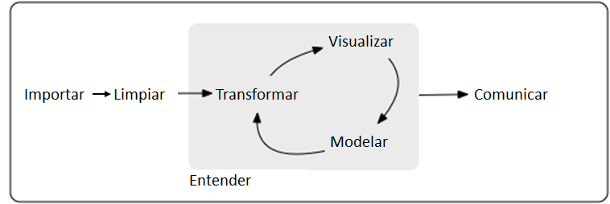
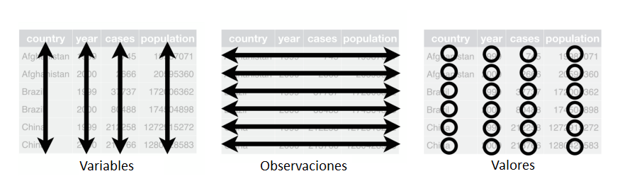
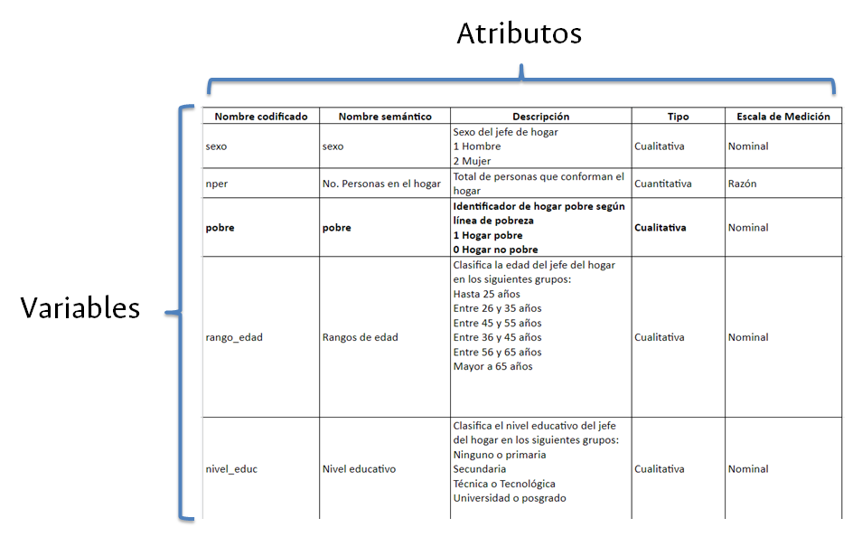

# Inicio

## Flujo de trabajo

{width=80%}

## Objetivos

Vamos a trabajar con datos tabulares. Existen 3 reglas que logran que un conjunto de datos tabulares esté organizado:

* Cada variable debe tener su propia columna
* Cada observación debe tener su propia fila
* Cada valor debe estar en su propia celda

{width=80%}

## Síntomas de datos desordenados

* Los encabezados de las columnas son valores, no nombres de variables
* En una misma columna se guardan múltiples valores
* Las variables están tanto en columnas como en filas
* Múltiples tipos de unidades observacionales se guardan en la misma tabla
* Una misma unidad observacional está alojada en múltiples tablas

## Buena práctica #1: tener información de contexto del problema de estudio

Para todos los conjuntos de datos con los que trabajemos es importante tener un contexto que nos brinde información sobre cómo fueron recolectados, en qué año(s), qué técnicas de muestreo y recolección se usaron para obtener las observaciones y qué personas o entidades fueron los responsables.

* Si los datos los recolectamos nosotros hablamos de **información primaria** y en nuestros reportes/informes debemos hacer explícito el contexto referido.
* Si los datos los obtuvimos de otra fuenta hablamos de **información secundaria** y en los reportes derivados igualmente debemos procurar obtener y referenciar el contexto referido para los datos.

## Buena práctica #2: construir diccionario de datos

* Consiste en asignar atributos a cada variable de nuestras bases de datos.
* Facilita la lectura y tratamiento de los datos.
* Aporta a la reproducibilidad y repetibilidad de los análisis.

Ejemplo:

{width=80%}

> Para profundizar: revise el material sobre [cómo organizar tablas](https://www.jstatsoft.org/article/view/v059i10/v59i10.pdf).

# Práctica

Esta práctica está diseñada para aprender a utilziar las funciones de tablas de datos...

Para esta sección usaremos las librerías 

```{r}
library("dplyr")
library("readxl")
library("magrittr")
library("scales")

```


## Conjunto de datos

Utilizaremos una muestra de los datos del examen Saber 11 para realizar el análisis. Puedes descargar el conjunto de datos desde el siguiente enlace:

[Saber 11 (muestra)](01_data/programacion/saber-11_sample.xlsx)

## Carga de datos desde Excel

Para trabajar con archivos de Excel, utilizamos el paquete `readxl`. Este paquete permite leer archivos Excel sin necesidad de instalar programas adicionales como MS Excel. A continuación, se carga el archivo y se exploran algunos aspectos básicos del conjunto de datos.

```{r}
# Cargamos el paquete necesario
library("readxl")

# Leemos el archivo Excel, especificando la hoja
tb_data <- read_excel("01_data/programacion/saber-11_sample.xlsx", sheet = "sample")

# Verificamos la clase del objeto (será un tibble)
class(tb_data)

# Contamos las filas
nrow(tb_data)

# Contamos las columnas
ncol(tb_data)

# Exploramos el conjunto de datos para ver sus variables y tipos de datos
glimpse(tb_data)

```

**Explicación**:
- `read_excel()`: carga el archivo Excel. El argumento `sheet` indica cuál hoja cargar.
- `class()`: devuelve el tipo de objeto en R, en este caso un tibble, una versión moderna de los data frames.
- `nrow()` y `ncol()`: cuentan el número de filas y columnas, respectivamente.
- `glimpse()`: proporciona una vista rápida del conjunto de datos, mostrando cada variable y sus primeros valores.

## Uso de pipes (tuberías)

Las "tuberías" (`pipes`) en R, implementadas mediante el operador `%>%`, facilitan encadenar varias operaciones de una manera legible y lógica. Veamos cómo aplicarlas en el análisis.

```{r}
# Usamos tuberías para contar las columnas
tb_data %>% 
  ncol()

# Usamos tuberías para hacer un vistazo rápido a los datos
tb_data %>% 
  glimpse()

```

**Explicación**:
- `%>%`: permite encadenar funciones en secuencia. En lugar de anidar funciones dentro de otras, podemos pasar el resultado de una función como primer argumento de la siguiente.

Este enfoque con pipes simplifica el código y lo hace más legible. Además, la sintaxis se asemeja a la lectura secuencial de acciones.

## Transformaciones básicas

En esta sección, vamos a aplicar algunas transformaciones básicas a nuestro conjunto de datos utilizando el poder de las funciones del tidyverse. Estas transformaciones te permiten seleccionar, modificar y agregar columnas de manera eficiente.

### Seleccionar columnas con `select()`

La función `select()` te permite elegir un subconjunto de columnas. Puedes seleccionar columnas por nombre o por patrones específicos.

```{r}
tb_data %>% 
  select(FTP_CONSECUTIVO, ESTU_EXAM_DEPT_PRESENTACION, INGLES_PUNT)

```

En este ejemplo, seleccionamos tres columnas específicas: `FTP_CONSECUTIVO`, `ESTU_EXAM_DEPT_PRESENTACION`, y `INGLES_PUNT`.

### Seleccionar columnas usando reglas con `tidy select`

`tidy select` permite seleccionar columnas de acuerdo con ciertas reglas, como las que empiezan con un prefijo específico. Esto es útil cuando trabajas con muchos campos y quieres hacer selecciones basadas en patrones.

```{r}
tb_data %>% 
  select(starts_with("ESTU"))

tb_data %>% 
  select(ends_with("PUNT"))

```

Aquí, seleccionamos todas las columnas que comienzan con "ESTU", correspondientes a la información del estudiante. También aquellas que finalizan en "PUNT", lo cual nos devuelve todas las columnas relacionadas con los puntajes en diferentes áreas del examen.

### Transformar una columna con `mutate()`

La función `mutate()` es clave para transformar una columna o crear una nueva. Puedes utilizarla para hacer cálculos o cambiar el contenido de una columna existente.

```{r}
tb_data %>% 
  mutate(INGLES_PUNT = INGLES_PUNT * 1.1)


```

En este ejemplo, estamos aumentando el puntaje de inglés en un 10%. Esta modificación se aplica directamente a la columna `INGLES_PUNT`.

### Cambiar el tipo de una columna con `mutate()`

Si necesitas cambiar el tipo de datos de una columna, también puedes usar `mutate()` junto con funciones como `as.factor()`, `as.numeric()`, etc.

```{r}
tb_data %>% 
  mutate(ESTU_NACIMIENTO_MES = as.factor(ESTU_NACIMIENTO_MES))

```

Aquí, estamos convirtiendo la columna `ESTU_NACIMIENTO_MES` en un factor, lo que es útil cuando trabajas con variables categóricas.

La función `cut()` divide una variable continua (en este caso, la edad) en intervalos definidos, creando una nueva columna de categorías. Asegúrate de agregar etiquetas para identificar mejor cada grupo etario.

```{r}
tb_data %>% 
  mutate(
    grupo_etario = cut(ESTU_EDAD, 
                       breaks = c(0, 10, 15, 20, 30, Inf), 
                       labels = c("Niñez", "Adolescencia", "Juventud", "Adulto joven", "Adulto"))
  )

```

- `breaks`: define los puntos de corte para los grupos.
- `labels`: asigna nombres descriptivos a cada grupo.

La función `if_else()` permite transformar variables binarias o aplicar lógica condicional. En este caso, estamos convirtiendo la variable `ECON_SN_COMPUTADOR` (donde "0" representa "No" y "1" representa "Sí") a un formato más legible.

```{r}
tb_data %>% 
  mutate(
    tiene_computador = if_else(ECON_SN_COMPUTADOR == 0, "No", "Sí")
  )

```

- `if_else(condition, true, false)`: revisa si la condición es verdadera (`ECON_SN_COMPUTADOR == 0`), en cuyo caso asigna "No", de lo contrario, asigna "Sí".

### Agregar una nueva columna con `mutate()`

Además de modificar columnas existentes, `mutate()` te permite crear nuevas columnas basadas en cálculos o transformaciones de otras variables.

```{r}
tb_data %>% 
  mutate(TOTAL_PUNT = MATEMATICAS_PUNT + LENGUAJE_PUNT + CIENCIAS_SOCIALES_PUNT)

```

Este ejemplo muestra cómo agregar una nueva columna llamada `TOTAL_PUNT` que contiene la suma de los puntajes en matemáticas, lenguaje y ciencias sociales.

### Transformación optimizada con `across()`

La función `across()` es muy útil cuando deseas aplicar una misma transformación a múltiples columnas de manera simultánea, lo que reduce la repetición de código.

```{r}
tb_data %>% 
  mutate(across(ends_with("PUNT"), rescale))

```

En este caso, estamos aplicando una transformación a todas las columnas que comienzan con "PUNT", aumentando sus valores en un 5%. El uso de `across()` permite aplicar esta operación de forma eficiente a todas las columnas seleccionadas.


### Ordenar por puntaje en matemáticas de mayor a menor

La función `arrange()` se utiliza para ordenar las filas de un conjunto de datos en función de una o más columnas. Puedes ordenar de manera ascendente o descendente.

```{r}
tb_data %>% 
  arrange(desc(MATEMATICAS_PUNT))

```

- `arrange(desc(PUNT_MATEMATICAS))`: ordena las filas por la columna `PUNT_MATEMATICAS` en orden descendente (de mayor a menor).


### Filtrar usando condicionales con `filter()`

La función `filter()` permite seleccionar filas que cumplen con condiciones específicas. Puedes usar operadores lógicos como `==`, `!=`, `>`, `<`, `>=`, `<=` y `&` para combinar condiciones.

Ejemplo: Filtrar estudiantes mayores de 18 años que tengan computador.

```{r}
tb_data %>% 
  filter(ESTU_EDAD > 18, ECON_SN_COMPUTADOR == 0)


```

- `ESTU_EDAD > 18`: selecciona estudiantes mayores de 18 años.
- `ECON_SN_COMPUTADOR == 0`: selecciona estudiantes que no tienen computador.

### Filtrar un top usando `slice_*()`

Las funciones `slice_max()` y `slice_min()` seleccionan las filas con los valores más altos o más bajos de una variable específica.

Ejemplo: Seleccionar los 5 estudiantes con los puntajes más altos en la prueba de matemáticas.

```{r}
tb_data %>% 
  slice_max(MATEMATICAS_PUNT, n = 5)

```

- `slice_max(PUNT_MATEMATICAS, n = 5)`: selecciona las 5 filas con los puntajes más altos en la columna `PUNT_MATEMATICAS`.

### Obtener una muestra aleatoria usando `slice_sample()`

La función `slice_sample()` permite obtener una muestra aleatoria de un número determinado de filas o un porcentaje del conjunto de datos.

Ejemplo: Obtener una muestra aleatoria del 10% de los estudiantes.

```{r}
tb_data %>% 
  slice_sample(prop = 0.1)

tb_data %>% 
  slice_sample(n = 100)


```

- `prop = 0.1`: selecciona el 10% de las filas de manera aleatoria.
- Alternativamente, puedes usar `n = 100` para obtener un número específico de filas aleatorias.


# Descriptivos

Los estadísticos descriptivos son fundamentales para resumir y entender las características de los datos. Proveen información crucial sobre la distribución y la variabilidad de las variables numéricas. Algunos de los estadísticos más comunes son:

- **Media**: es el promedio de los valores de una variable.
- **Varianza**: mide la dispersión de los datos en torno a la media.
- **Desviación estándar**: es la raíz cuadrada de la varianza y expresa la dispersión en las mismas unidades que los datos.
- **Mediana**: es el valor que separa la mitad superior de la mitad inferior de un conjunto de datos ordenados.
- **Cuartiles**: dividen los datos en cuatro partes iguales.
- **Máximo y mínimo**: el valor más alto y más bajo de una variable.

A continuación se presentan las funciones en R para calcular estos estadísticos:

```{r}
#| eval: false
mean()     # para la media
var()      # para la varianza
sd()       # para la desviación estándar
median()   # para la mediana
quantile() # para los cuartiles
max()      # para el máximo
min()      # para el mínimo

```

Veamos cómo aplicar estos conceptos con ejemplos usando el conjunto de datos `tb_data`.


## Promedio (Media)

La media es una medida de tendencia central que indica el valor promedio de una variable. Se calcula sumando todos los valores y dividiéndolos entre el número de observaciones.

```{r}
tb_data %>% 
  summarise(promedio_edad = mean(ESTU_EDAD, na.rm = TRUE))

```

- `mean(ESTU_EDAD, na.rm = TRUE)`: calcula el promedio de la variable `ESTU_EDAD`, ignorando los valores faltantes (`NA`).
- El resultado es un solo valor que representa la edad promedio de los estudiantes.

## Varianza

La varianza mide la variabilidad o dispersión de los datos en torno a la media. Si la varianza es alta, significa que los valores están muy dispersos; si es baja, los valores están más cerca de la media.

```{r}
tb_data %>% 
  summarise(varianza_edad = var(ESTU_EDAD, na.rm = TRUE))

```

- `var(ESTU_EDAD, na.rm = TRUE)`: calcula la varianza de la variable `ESTU_EDAD`, ignorando valores faltantes.
- La varianza está en las unidades al cuadrado de la variable original.


## Desviación estándar

La desviación estándar es una medida más intuitiva de la dispersión que la varianza, ya que se expresa en las mismas unidades que los datos originales.

```{r}
tb_data %>% 
  summarise(desviacion_edad = sd(ESTU_EDAD, na.rm = TRUE))

```

- `sd(ESTU_EDAD, na.rm = TRUE)`: calcula la desviación estándar de `ESTU_EDAD`.
- Este valor representa cuánto, en promedio, se desvían las edades de la media.

## Mediana

La mediana es una medida robusta de tendencia central, que no se ve tan afectada por valores atípicos (outliers). Representa el valor que está en el centro de un conjunto de datos ordenados.

```{r}
tb_data %>% 
  summarise(mediana_edad = median(ESTU_EDAD, na.rm = TRUE))

```

## Cuartiles

Los cuartiles dividen los datos en cuatro partes iguales. El primer cuartil (Q1) es el valor por debajo del cual se encuentra el 25% de los datos, y el tercer cuartil (Q3) es el valor por debajo del cual está el 75%.

```{r}
tb_data %>% 
  summarise(q1 = quantile(ESTU_EDAD, 0.25, na.rm = TRUE),
            mediana = quantile(ESTU_EDAD, 0.5, na.rm = TRUE),
            q3 = quantile(ESTU_EDAD, 0.75, na.rm = TRUE))

```


## Máximo y mínimo

Los valores máximo y mínimo son útiles para identificar el rango de una variable. Nos indican cuáles son los valores extremos.

```{r}
tb_data %>% 
  summarise(min_edad = min(ESTU_EDAD, na.rm = TRUE),
            max_edad = max(ESTU_EDAD, na.rm = TRUE))

```


### Nota:

En cada una de estas funciones hemos agregado el argumento `na.rm = TRUE` para ignorar los valores faltantes. Si tienes valores `NA` en los datos y no los manejas, algunas funciones como `mean()` o `sd()` no devolverán resultados.


## Tablas agrupadas

Las tablas agrupadas permiten calcular estadísticas descriptivas para diferentes grupos dentro de los datos. Esto es útil cuando deseas analizar patrones o tendencias dentro de subgrupos específicos, como diferentes regiones, categorías o niveles.

### Promedio (Media)

Para calcular la media de una variable, agrupando los datos por otra variable (en este caso, por el departamento donde el estudiante presentó el examen):

```{r}
tb_data %>% 
  group_by(ESTU_EXAM_DEPT_PRESENTACION) %>% 
  summarise(promedio_edad = mean(ESTU_EDAD, na.rm = TRUE))

```

- `group_by(ESTU_EXAM_DEPT_PRESENTACION)`: agrupa los datos por el departamento en el que el estudiante presentó el examen.
- `summarise()`: calcula el promedio de la edad (`ESTU_EDAD`) para cada departamento, ignorando los valores faltantes.

Este código devolverá una tabla donde cada fila corresponde a un departamento y la columna `promedio_edad` muestra la edad promedio de los estudiantes en ese departamento.

### Varianza

De manera similar, podemos calcular la varianza de la edad para cada grupo (departamento):

```{r}
tb_data %>% 
  group_by(ESTU_EXAM_DEPT_PRESENTACION) %>% 
  summarise(varianza_edad = var(ESTU_EDAD, na.rm = TRUE))

```

- `var(ESTU_EDAD, na.rm = TRUE)`: calcula la varianza de las edades por departamento, ignorando los valores faltantes.

Esto te permitirá ver qué tan dispersas son las edades de los estudiantes dentro de cada departamento.

### Desviación estándar

Para calcular la desviación estándar agrupada:

```{r}
tb_data %>% 
  group_by(ESTU_EXAM_DEPT_PRESENTACION) %>% 
  summarise(desviacion_edad = sd(ESTU_EDAD, na.rm = TRUE))

```

- `sd(ESTU_EDAD, na.rm = TRUE)`: calcula la desviación estándar de las edades dentro de cada departamento.

### Mediana

La mediana también puede calcularse por grupo para obtener una medida de tendencia central menos sensible a valores atípicos:

```{r}
tb_data %>% 
  group_by(ESTU_EXAM_DEPT_PRESENTACION) %>% 
  summarise(mediana_edad = median(ESTU_EDAD, na.rm = TRUE))

```


### Mínimo y máximo

Para encontrar los valores mínimo y máximo dentro de cada departamento:

```{r}
tb_data %>% 
  group_by(ESTU_EXAM_DEPT_PRESENTACION) %>% 
  summarise(
    min_edad = min(ESTU_EDAD, na.rm = TRUE),
    max_edad = max(ESTU_EDAD, na.rm = TRUE)
  )

```

Esto te dará los valores más extremos de la edad por cada departamento.


### Cuartiles

Si deseas obtener los cuartiles de la edad para cada grupo:

```{r}
tb_data %>% 
  group_by(ESTU_EXAM_DEPT_PRESENTACION) %>% 
  summarise(
    q1 = quantile(ESTU_EDAD, 0.25, na.rm = TRUE),
    mediana = quantile(ESTU_EDAD, 0.5, na.rm = TRUE),
    q3 = quantile(ESTU_EDAD, 0.75, na.rm = TRUE)
    )

```

Con esto, obtendrás el primer cuartil (Q1), la mediana y el tercer cuartil (Q3) para cada departamento.

La función `across()` de **dplyr** es una herramienta poderosa que permite realizar operaciones en varias columnas al mismo tiempo dentro de las funciones `mutate()`, `summarise()` o `filter()`. 


## ¿Cómo funciona `across()`?

1. **Selección de columnas**: `across()` te permite especificar un conjunto de columnas de manera flexible utilizando helpers como `starts_with()`, `contains()`, `ends_with()`, etc., o simplemente seleccionando nombres de columnas directamente.
   
2. **Aplicación de funciones**: Con `across()`, puedes aplicar una función a todas las columnas seleccionadas. Por ejemplo, podrías transformar todas las columnas numéricas con una misma operación, como redondear o calcular un promedio, sin tener que repetir la operación para cada columna individualmente.

### Uso básico de `across()`

**Sintaxis general**:

```{r}
#| eval: false

across(.cols, .fns, ...)

```

- `.cols`: Especifica las columnas a las que se aplicará la función. Puede ser un rango de nombres, un helper de tidyselect (como `starts_with()`), o una lista de columnas.
- `.fns`: La función que se va a aplicar a las columnas seleccionadas. Puede ser cualquier función que tome como argumento una columna (por ejemplo, `mean()`, `sd()`, etc.).
- `...`: Argumentos adicionales que se pasan a la función especificada.

### Ejemplos con `across()`

#### Aplicar una transformación a varias columnas

Supongamos que queremos convertir varias columnas a mayúsculas o calcular una misma operación en múltiples columnas. Podemos hacerlo con `across()` en `summarise()`:

```{r}
tb_data %>% 
  summarise(across(starts_with("ESTU_DISC"), sum, na.rm = TRUE))

```

Esto calcula la cuenta de todas las columnas que comienzan con "ESTU_DISC", ignorando los valores faltantes.

#### Usar diferentes funciones en diferentes columnas

Puedes aplicar diferentes funciones a diferentes columnas usando una lista de funciones:

```{r}
tb_data %>% 
  summarise(across(c(ESTU_EDAD, INGLES_PUNT), list(promedio = mean, sd = sd), na.rm = TRUE))

```

Este ejemplo calcula tanto el promedio como la desviación estándar de las columnas `ESTU_EDAD` y `PUNT_GLOBAL`.

#### Aplicar múltiples funciones a las mismas columnas

Si deseas aplicar varias funciones a las mismas columnas, `across()` también lo permite:

```{r}
tb_data %>% 
  summarise(across(ends_with("PUNT"), list(promedio = mean, desviacion = sd), na.rm = TRUE))

```

Esto aplicará `mean()` y `sd()` a todas las columnas que terminen con "PUNT", generando columnas nuevas con los nombres `promedio` y `desviacion`.

Ventajas de `across()`

- **Flexibilidad**: Puedes seleccionar columnas de manera dinámica.
- **Claridad**: El código es más legible y más fácil de mantener que repetir operaciones manualmente para cada columna.
- **Escalabilidad**: Puedes aplicar funciones a múltiples columnas con menos código y menos esfuerzo.

### Casos de uso comunes

- **Transformación de datos**: Cambiar el tipo de datos de varias columnas (por ejemplo, convertir varias columnas de carácter a factor).
- **Resúmenes estadísticos**: Calcular medidas como la media, mediana, desviación estándar, etc., para múltiples columnas.
- **Renombrar múltiples columnas**: Aplicar una función para ajustar nombres de columnas.
  
En resumen, `across()` es una herramienta indispensable para aplicar transformaciones y resúmenes de manera eficiente y clara cuando trabajas con múltiples columnas en `dplyr`.

Las **funciones de tidyselect** son una serie de herramientas que te permiten seleccionar columnas de un dataframe de manera eficiente y flexible en `dplyr`, principalmente usadas con funciones como `select()`, `rename()`, `mutate()` y `across()`. Estas funciones están diseñadas para ser intuitivas y trabajar bien con patrones comunes en el nombre de las columnas. A continuación te explico las más comunes.

### Principales funciones de `tidyselect`

#### **`starts_with()`**

Selecciona todas las columnas cuyos nombres comienzan con un prefijo específico.

```{r}
select(tb_data, starts_with("ECON"))

```

Esto selecciona todas las columnas cuyos nombres comienzan con "ECON".

#### **`ends_with()`**

Selecciona todas las columnas cuyos nombres terminan con un sufijo específico.

```{r}
select(tb_data, ends_with("_PUNT"))

```

Esto selecciona todas las columnas cuyos nombres terminan con "_score".

#### **`contains()`**

Selecciona todas las columnas que contienen una cadena de texto específica en su nombre.

```{r}
select(tb_data, contains("MPIO"))

```

Esto selecciona todas las columnas que contienen "MPIO" en su nombre.

#### **`everything()`**

Selecciona todas las columnas de un dataframe. Es útil cuando quieres reordenar columnas colocando algunas al principio y luego mantener el resto.

```{r}
select(tb_data, ESTU_EDAD, everything())

```

Esto coloca la columna `ESTU_EDAD` al principio, y el resto de las columnas permanecen en el orden original.

#### **`one_of()`**

Selecciona columnas por su nombre a partir de un vector, omitiendo las que no existen.

```{r}
columnas_seleccionadas <- c("FILOSOFIA_PUNT", "ESTU_EDAD")
select(tb_data, one_of(columnas_seleccionadas))

```

Esto selecciona solo las columnas que estén presentes en el dataframe a partir del vector `columnas_seleccionadas`.

#### **`all_of()`**

Es similar a `one_of()`, pero arroja un error si alguna columna no existe en el dataframe. Es útil para asegurar que todas las columnas en el vector están presentes.

```{r}
columnas_seleccionadas <- c("FILOSOFIA_PUNT", "ESTU_EDAD")
select(tb_data, all_of(columnas_seleccionadas))

```

Si alguna columna en `columnas_seleccionadas` no existe, el código fallará.

#### **`any_of()`**

Selecciona las columnas en un vector que estén disponibles, pero ignora las que no existan, sin generar error.

```{r}

select(tb_data, any_of(c("PUNT_GLOBAL", "INEXISTENTE")))

```

Esto selecciona `PUNT_GLOBAL` pero ignora la columna `INEXISTENTE` si no está presente.

#### **`last_col()`**

Selecciona la última columna del dataframe. Es útil cuando deseas trabajar con la última columna independientemente de su nombre.

```{r}
select(tb_data, last_col())

```

Esto selecciona la última columna en el dataframe `tb_data`.

### Ejemplos combinando funciones `tidyselect`

Puedes usar múltiples funciones de `tidyselect` en una sola llamada a `select()` para seleccionar columnas con mayor precisión. Por ejemplo:

```{r}
tb_data %>% 
  select(ends_with("PUNT"), starts_with("ECON"), ESTU_EDAD)
  
```

Esto selecciona todas las columnas que terminan con "PUNT", todas las columnas que comienzan con "ECON" y la columna `ESTU_EDAD`.

### Uso de `tidyselect` con `across()`

Además de `select()`, estas funciones también son útiles en `across()` cuando aplicas transformaciones a múltiples columnas:

```{r}
tb_data %>%
  mutate(across(ends_with("PUNT"), round, 0))
  
```

Esto redondea todas las columnas que comienzan con "PUNT" a un decimal.


